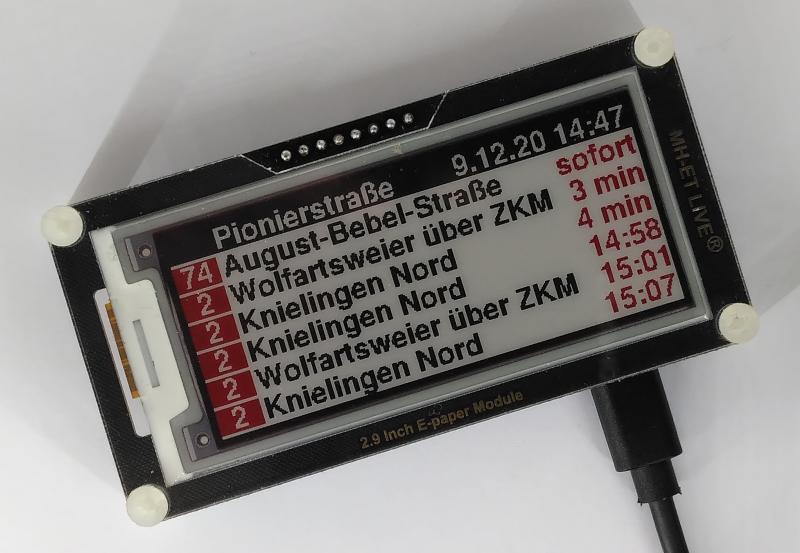
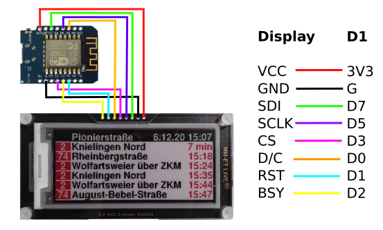
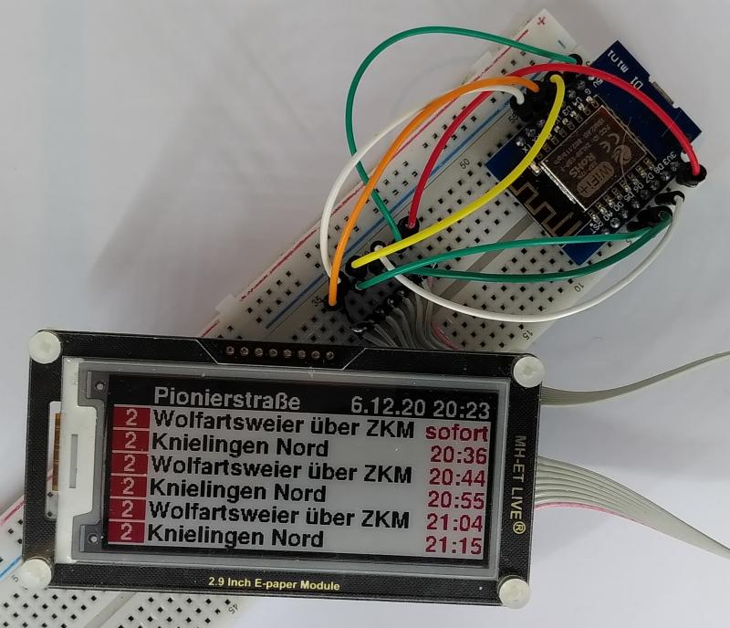
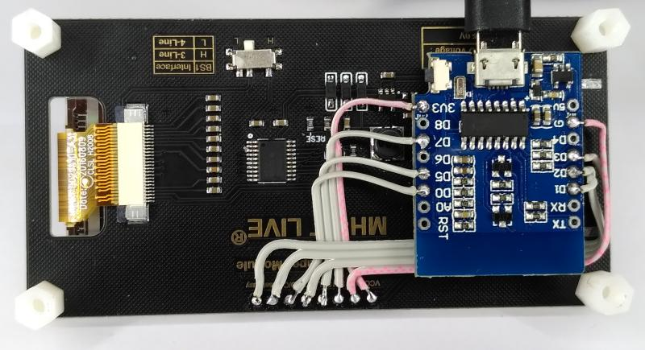

# KVV

We recently (Nov 2020) got a new tram extension in Karlsruhe, Germany.
To celebrate the fact that there's now a station pretty close to our
home I decided to build a virtual timetable. And since I had some
spare ESP8266 powered Wemos D1 and a 2.9" tricolor e-paper display I
decided to use these.

## Breadboard setup

The whole setup is pretty simple and can be wired on a breadboard as
depicted.

Since the epaper display keeps the data even if not powered at all the
ESP8266 simply boots up, connects to the (hardcoded) WiFi network,
downloads the live data, updates the display and then powers down/goes
into deep sleep. The whole setup can thus be run from a battery with
the reset button exposed so it can be pushed to boot the ESP8266 and 
to update the display.

## Final setup

For the final setup depicted above I unsoldered the connector on the
displays rear and used double sided tape to stick the Wemos D1 to the
display. A total of eight short wires are needed to connect both
PCBs. The resulting setup is sufficiently small and robust.

## Where does the data come from?

The KVV offers a [live timetable](http://live.kvv.de). A quick look
at the network traffic (or at the embedded Javascript code) reveals that
some easy to handle JSON can be downloaded e.g. for the tram stop "Pionierstraße" using [this http get request](https://live.kvv.de/webapp/departures/bystop/PIO?maxInfos=10&key=377d840e54b59adbe53608ba1aad70e8).

## The sketch

The sketch is based on the
[BasicHttpsClient.ino](https://github.com/esp8266/Arduino/blob/master/libraries/ESP8266HTTPClient/examples/BasicHttpsClient/BasicHttpsClient.ino)
for the ESP8266. The display is driven using the [Adafruit EPD
library](https://github.com/adafruit/Adafruit_EPD). And finally the
JSON parsing is done using the [ArduinoJson
library](https://github.com/bblanchon/ArduinoJson). All these
dependencies can be installed from the library manager within the
Arduino IDE.

A custom generated font is being used since the fonts distributed by
Adafruit with the Adafruit GFX library only include 7 bit fonts and
we need an 8 bit font for the german umlauts used by the KVV.

## Related projects

- [Python bindings for the KVV live API](https://github.com/Nervengift/kvvliveapi)
- [MMM-KVV - Magic Mirror KVV display](https://github.com/yo-less/MMM-KVV)
